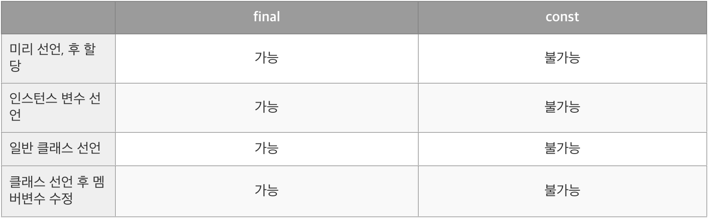

# Dart Practice

## Variables

- [variables.dart](variables.dart)

### 1. 자료형을 선언

```dart
String kuku = 'Kuku';
int kukuAge = 2;
```

### 2. var

```dart
// guessString = 1; => 오류 발생
// 첫번째 선언된 변수가 string으로 추론되므로 이후, 다른 값 할당 X

var guessString = 'Kuku2';
```

- 타입 추론을 허용하는 변수 선언
- 처음 할당된 변수의 추론 타입 이외의 값을 할당하는 것이 불가능함.

### 3. dynamic

```dart
dynamic guessDynamic = 'Kuku3';
guessDynamic = 123;
guessDynamic = 123.456;
guessDynamic = true;
```

- 단일타입으로 제한되지 않는 변수 선언
- var와 달리 처음 할당된 값의 자료형이 무엇이든 상관없이 다른 값 할당 가능

### 4. final

```dart
final finalString;
finalString = 'This is Final String';
print(finalString);
```

- 초기값을 할당한 이후, 변경 불가.
- 변수 선언과 초기화를 다른 시점에 할당할 수 있음.
- **런타임 시점에 초기화**가 이루어진다.
- 런타임 시점에 초기화 되기 때문에 어떤 함수의 실행값 등, 런타임에 발생하는 값들을 할당할때 사용된다.

### 5. const

```dart
const constString = 'This is Const String';
print(constString);
```

- 초기값을 할당한 이후, 변경 불가.
- 컴파일 타임 상수이기 때문에 final과 달리 **컴파일 시점에 초기화**가 이루어진다.
- 선언과 초기화를 다른 시점에 할 수 없음.



### 6. late

```dart
class lateTest {
  // late 키워드를 사용하여 선언을 먼저하고 나중에 변수 초기화를 한다는 것을 알림
  late String name;

  // setName 메서드를 사용해 name 변수 초기화
  void setName(String newName) {
    name = newName;
  }

/**
 * 만약 setName 메서드를 먼저 호출하지 않고 Hi 메서드를 호출하면
 * LateInitializationError: Field 'name' has not been initialized. 에러 발생
 * => 변수가 초기화 되기 전에 변수를 사용하려해서 발생하는 에러.
 */
  String Hi() {
    return 'Hi, $name';
  }
}
```

- 변수 선언시, 초기화를 미룰수 있음. (선언과 초기화 시점을 다르게 할때 사용.)
